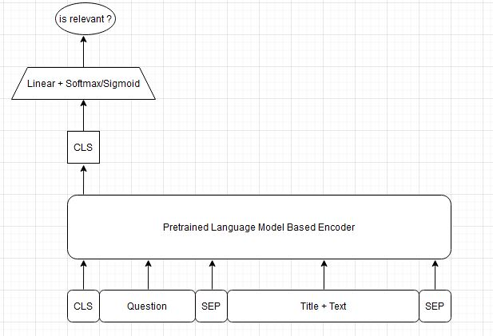

# LTR_CrossEncoder: Legal Text Retrieval Zalo AI Challenge 2021

We propose a cross encoder model (LTR_CrossEncoder) for information retrieval, re-retrieval text relevant base on result of elasticsearch
- Model achieved 0.747 F2 score in public test (Legal Text Retrieval Zalo AI Challenge 2021)
- If using elasticsearch only, our F2 score is 0.54

## Algorithm design

Our algorithm includes two key components:
- Elasticsearch
- Cross Encoder Model

## Elasticsearch

Elasticsearch is used for filtering top-k most relevant articles based on BM25 score.

## Cross Encoder Model
<p align="center">

</p>

Our model accepts query, article text (passage) and article title as inputs and outputs a relevant score of that query and that article. Higher score, more relavant. We use pretrained `vinai/phobert-base` and `CrossEntropyLoss ` or `BCELoss` as loss function

### Train dataset
Non-relevant samples in dataset are obtained by `top-10` result of elasticsearch,
the training data (`train_data_model.json`) has format as follow:
```
[
    {
        "question_id": "..."
        "question": "..."
        "relevant_articles":[
            {
                "law_id": "..."
                "article_id": "..."
                "title": "..."
                "text": "..."
            },
            ...
        ]
        "non_relevant_articles":[
            {
                "law_id": "..."
                "article_id": "..."
                "title": "..."
                "text": "..."
            },
            ...
        ]
    },
    ...
]
```
### Test dataset
First we use elasticsearch to obtain k relevant candidates (`k=top-50` result of elasticsearch), then LTR_CrossEncoder classify which actual relevant article. The test data (`test_data_model.json`) has format as follow:
```
[
    {
        "question_id": "..."
        "question": "..."
        "articles":[
            {
                "law_id": "..."
                "article_id": "..."
                "title": "..."
                "text": "..."
            },
            ...
        ]
    },
    ...
]
```

### Training
Run the following bash file to train model:
```
bash run_phobert.sh
```

### Inference

We also provide model checkpoints. Please download these checkpoints if you want to make inference on a new text file without training the models from scratch. Create new checkpoint folder, unzip model file and push it in checkpoint folder.
https://drive.google.com/file/d/1oT8nlDIAatx3XONN1n5eOgYTT6Lx_h_C/view?usp=sharing

Run the following bash file to infer test dataset:
```
bash run_predict.sh
```
